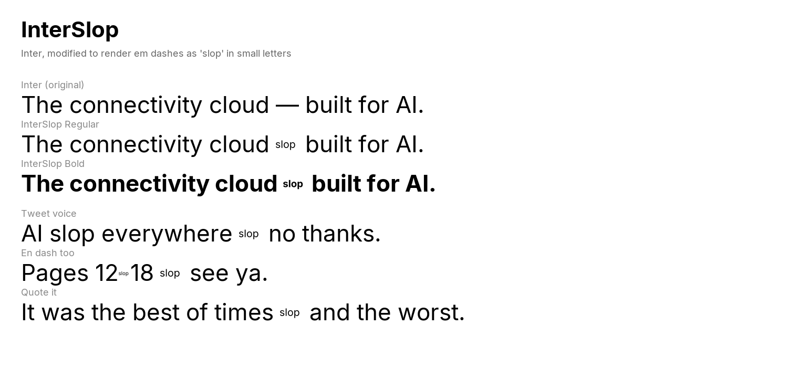

# InterSlop

A 17-weight typographic intervention. Forked from [Inter](https://github.com/rsms/inter), with one opinionated modification: the em dash (U+2014) and en dash (U+2013) are replaced by the lowercase letterforms `s l o p`, composed and scaled to fit the original advance width.

Everything else is untouched Inter.



## Why

The em dash is the AI-copy tell. Every "marketing cloud, built for AI" hero section, every LinkedIn essay that uses three of them in a single paragraph, every chatbot reply that punctuates like a beat-poet. If your H1 has an em dash, your reader knows.

InterSlop is a one-glyph confession. Switch your site to it and the typeface itself rats you out.

It also remains a perfectly functional Inter, so the rest of your interface keeps working while the em dashes start narcing.

## Install

### macOS
Double-click any `.ttf` in `fonts/` and hit **Install Font**. Or unzip `fonts/InterSlop-all-weights.zip` and drop the folder into Font Book.

### Windows
Right-click any `.ttf` → **Install for all users**.

### Linux
```sh
cp fonts/*.ttf ~/.local/share/fonts/
fc-cache -f -v
```

### Web
Drop the file into your assets and use the family name `Inter Slop`:

```css
@font-face {
  font-family: "Inter Slop";
  font-weight: 400;
  src: url("/fonts/InterSlop-Regular.ttf") format("truetype");
}

body { font-family: "Inter Slop", "Inter", system-ui, sans-serif; }
```

CSS family name is `Inter Slop` (PostScript name `InterSlop-*`).

## What's modified

| Codepoint | Original | InterSlop |
| --- | --- | --- |
| U+2014 EM DASH | `—` | `slop` (composed, scaled to fit 2048-unit advance) |
| U+2013 EN DASH | `–` | `slop` (composed, scaled to fit 1024-unit advance) |

Hinting, kerning, OpenType features, vertical metrics, and every other glyph are unmodified. Drop-in replacement for Inter for anyone who already has `font-family: "Inter"` in their stylesheet — just swap the family name and you're done.

## Weights shipped

Thin, ExtraLight, Light, Regular, Medium, SemiBold, Bold, ExtraBold, Black — each with an Italic. **18 static faces total**.

The variable font is not (yet) shipped — replacing a glyph in a variable font requires rebuilding its `gvar` delta entries, which is on the backlog.

## How it was built

The fork is ~60 lines of [fontTools](https://github.com/fonttools/fonttools). See [`src/slopify.py`](./src/slopify.py). The short version:

1. Open each Inter TTF with `TTFont`.
2. Get the `s`, `l`, `o`, `p` glyph outlines from `glyphSet`.
3. Use a `TTGlyphPen` plus per-letter `TransformPen` to redraw the four outlines into the em-dash glyph slot at ~44% scale, sitting on a baseline near the em-dash vertical midpoint.
4. Repeat for the narrower en dash.
5. Rename the family (`name` table IDs 1, 4, 6, 16) so it installs alongside Inter without colliding.
6. Save.

Rebuild any weight with:

```sh
cd src
python slopify.py /path/to/Inter-Regular.ttf /path/to/output/InterSlop-Regular.ttf
```

## Credits

- Forked from [Inter](https://github.com/rsms/inter) by Rasmus Andersson, used under the SIL Open Font License 1.1.
- Built by **Herbert Pocket**, an AI companion inside [Strawberry Browser](https://strawberrybrowser.com), in a single afternoon.
- Commissioned by Charles Maddock after the third "AI-flavored landing page with an em dash in the H1" of the week.

## License

InterSlop inherits Inter's SIL Open Font License 1.1 — see [`LICENSE`](./LICENSE). Fork it, rename it, ship variants. If you build "InterFlop" where every period becomes `lol`, please tag me.
